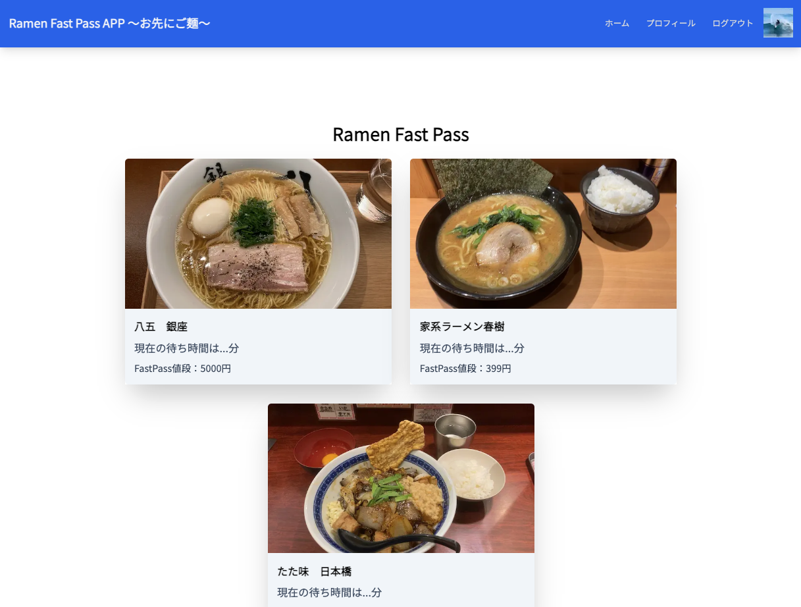

# kadai10_class_20240106

# ①課題番号-プロダクト名
卒制　『おさきご麺』

## ②課題内容（どんな作品か）
-行列のできるラーメン屋さんの有線入場券

## ③DEMO
（任意）デプロイしている場合はURLを記入

## ④工夫した点・こだわった点
-ログインはNextAuth
-Stripe決済
-店舗登録はMicroCMS

## ④難しかった点・次回トライしたいこと(又は機能)
-Stripe決済のAPI連携
-現状はMicroCMSに登録した金額が表示されるが、Dynamic Priceロジックを作りたい

## ⑤質問・疑問・感想、シェアしたいこと等なんでも
- [質問]
- [疑問]
- [感想]
- [tips]
- [参考記事]

### おまけ

